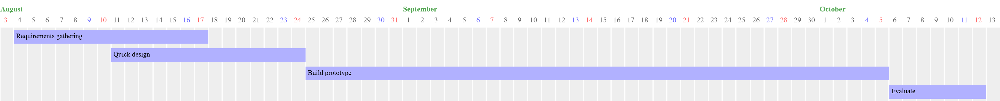

# Leave Management Information System (LeaMIS): An Automation of the Division Leave Management of DepEd Sto. Tomas City

---
> _Proponent(s)_: __Geovani P. Duqueza (_BSIT-ETEEAP_)__
---

## Project Overview

The proposed project aims to streamline DepEd Sto. Tomas City Division's leave management processes by developing the __Leave Management Information System (LeaMIS).__ The information system aims to allow partial or full automation of leave filing, tracking, and approval for all personnel under the division. The system will also aid the Division's management in making policies and decisions by providing real-time data related to personnel leaves and absences.

## Problem Statement

* Current manual processes are prone to errors and non-compliance to issued guidelines.
* The paper-only filing of leaves greatly contributes to the unhealthy bulk of paper-based documents of all other division processes.
* The communication of leave credits balances, in its various types, to all personnel is inefficient. It also somewhat lacks compliance to agency policies.
* The processing of leaves itself is time-consuming and over-burdening for all governance levels involved.
* The status of filed leaves is difficult to track or verify.
* Updating and keeping track of the many types of leave credits balances is tedious

## Objectives

1. Provide a user-friendly online system that will allow all personnel to do the following:
    * file leaves and track their status
    * check leave credits balances
    * allow the printing of CS Form No. 6 for signing with all required signatories already filled-in
    * allow the printing of digitally approved and signed CS Form No. 6 that is verifiable online
2. Afford an easy-to-use UI for the following types of users:
    * __Teachers__ and __non-teaching personnel__ that file leaves
    * __HR personnel__ that process and record leaves and manage the leave credits balances
    * __Managers__ that sign and approve leaves in the different governance levels and draft relevant policies
3. Automate the management and updating of leave credits.
4. Contribute to the streamlining of the Division's backoffice processes.
5. Reduce the reliance on paper-based transactions.
6. Offer the top management with choices of either a semi-automation (with reduced paper use) or a paperless, full automation of leave management.

## Scope

* Leave management
  * filing
  * tracking
  * approval
  * updating and conversion of leave credits balances
  * categorization of personnel, e.g., according to position and station
  * assignment of signatories to each personnel category
* Reporting and analytics

## Methodology

The __Prototyping Methodology__ has been selected for this project as it will allow for the continuous production of prototypes for evaluation and testing of management and end users until the release of the minimum viable product (MVP). It has the following steps:

1. Gather requirements
2. Quick design
3. Build prototype
4. Evaluate
5. Refine prototype

## Expected Outcomes

* Improved efficiency in the filing, approval, and tracking of leaves
* Decreased errors and non-compliance
* Lesser paper-based documents and paper work
* Automated updating of leave credits balances
* Easier checking of leave credits balances
* Better decision-making through data analytics

## Timeline

The whole project timeline shall consist of an initial requirements gathering and a flexible schedule for the prototyping cycle. To provide a minimum viable product, the developer/development team will attempt to complete a MVP in twenty weeks while undergoing at least three (3) or a maximum of five (5) prototyping cycles. Earlier completion of the project would also be possible depending on the challenges faced during the prototyping loops.

|       Process               |       Duration      |
|-----------------------------|:-------------------:|
|Requirements gathering       |       2 weeks       |
|Prototype design/refine loop:|   Up to 18 weeks    |
|\| _Quick design:_           |_1-2 weeks per cycle_|
|\| _Build prototype:_        |_2-6 weeks per cycle_|
|\| _Evaluate:_               |  _1 week per cycle_ |

###### Project LeaMIS: Sample Timeline (Single Cycle)

## Resources

* People:
  * Developer/development team
  * Personnel Unit of DepEd Sto. Tomas City
  * Approvers for different governance levels
  * Division top management
  * Testers selected from among the end users
* Development and testing machines:
  * Developer-owned desktop and laptop computers
  * Mobile devices
* Documents and Policies (non-exhaustive):
  * CSC MC No. 41, s. 1998 – _Omnibus Rules on Leave_
  * [DepEd Order no. 13, s. 2024 – _Revised Guidelines on the Grant of Vacation Service Credits for Teachers_](https://www.deped.gov.ph/wp-content/uploads/DO_s2024_013.pdf)

## Budget

The budget needed for the project will be contingent on two factors: development and deployment. To cover these costs, an estimated budget of ₱100,000.00 is proposed for the project. The following presents a rough itemization of the projected costs:

|         Item         |Estimated Cost|
|----------------------|-------------:|
|Domain Name (1st year)|      1,000.00|
|Webhosting (1st year) |      2,000.00|
|Electricity:          |     10,000.00|
|Labor and incidental  |     87,000.00|
|\| __TOTAL__          |  ₱ 100,000.00|